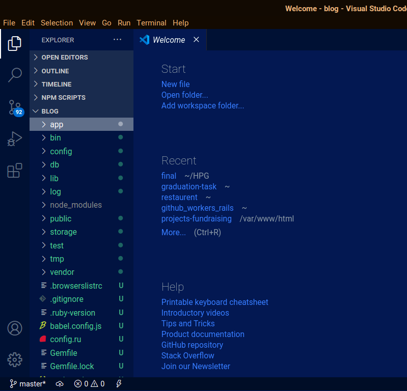
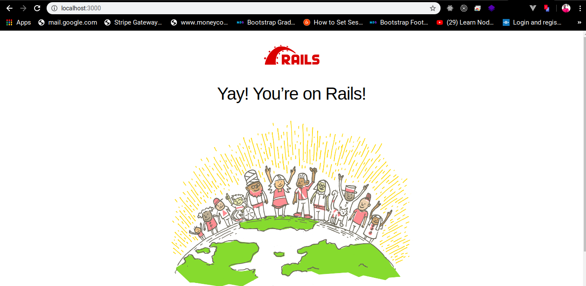

# Let's get started with Rails!
## I. Introduction to Rails Course
we are going to learn rails from scratch with meaningful explanations and examples.

### What is Rails?
Ruby on Rails, or Rails, is a server-side web application framework written in Ruby. Rails is a model–view–controller framework, providing default structures for a database, a web service, and web pages.
Ruby on Rails is open source software, which is free to use and includes everything you need to build fantastic web-applications, and it is easy to learn for anyone with basic programming knowledge.

### Why rails?
* The Rails framework helps developers to build websites and applications easily and fastly, because it abstracts and simplifies common repetitive tasks.

* One of key principles of Ruby on Rails development is convention over configuration. This means that the programmer does not have to spend a lot of time configuring files in order to setup  a rails app, Rails comes with a set of conventions which help speed up development.

* Programming is much faster than with other frameworks and languages, because of the object-oriented nature of Ruby and the vast collection of open source code available within the Rails community.

* Ruby code is very readable and mostly self-documenting. This increases productivity, as there is less need to write out separate documentation, making it easier for other developers to pick up existing projects.

* Rails is strong on testing, and has good testing frameworks.

* rails is easy and fast to learn.

### Requirements to study Rails and run Ruby on Rails projects
Before you install Rails, you should check to make sure that you have these installed in your system:

* Ruby
* SQLite3/postgresql
* Node.js
* Yarn

how to check if they are installed:
**1. Ruby**
> check Version:
>
>> $ ruby -v  
ruby 2.5.0
>
>> Rails requires Ruby version 2.5.0 or later. If the version returned is less than 2.5, you'll need to install a fresh copy of Ruby.  
>> if it is not installed follow this link to install it [See Ruby Installation Guide!](https://www.ruby-lang.org/en/documentation/installation/).  

**2. SQLite3/PostgreSQL**
> For Sqlite3:  
>> $ sqlite3 --version  
>> To install it: [See SQLITE3 installation guide Guide!](https://www.linuxcloudvps.com/blog/how-to-install-sqlite-on-ubuntu-16-04/).  
> For PostgreSQL:
>> $ psql --version  
>> To install it: [See PostgreSQL installation guide Guide!](https://www.digitalocean.com/community/tutorials/how-to-install-and-use-postgresql-on-ubuntu-18-04)

**3. Node**
> $ node --version
>
>> To install it: [See node js website!](https://nodejs.org/en/download/).

**4. yarn**
> $ yarn -v
>
>> To install it: [See yarn website!](https://classic.yarnpkg.com/en/docs/install).

### Installation of Rails
To istall Rails write this simple command in your terminal:  
> $ gem install rails  

To verify that rails is installed:  
> $ rails --version

### Creatng first Rails project
To create your first rails app, open a terminal, navigate to a directory where you have rights to create files, and type:    
> rails new project_name -d database(sqlite3/postgresql)  
>
for example, to create a blog app with sqlite3 database:   
> rails new blog -d sqlite3  // but for sqlite3 database it is not necessary to specify it because it is default rails app db.    
>
you can write: 
> $ rails new blog  
>
to create a blog app with postgresql database write in terminal:  
> rails new blog -d postgresql  

This will create a Rails application called Blog in a blog directory and to install the gem dependencies that are already mentioned in Gemfile first navigate to blog folder by writing this command:
> $ cd blog
> $ bundle install

### Running your first Rails app/project
Project folder structure:  
  

go to terminal in the project folder and run: **rails db:create** and then **rails s** to start rails server.  
after that go to browser and write in: **localhost:3000**  
you will see a page like this:
  

> To stop the web server, hit **Ctrl+C** in the terminal window where it's running.

### rails project structure
To dispaly a text in rails, you need to atleast create a controller and a view.

A **controller**'s purpose is to receive specific requests for the application. Routing decides which controller receives which requests. Often, there is more than one route to each controller, and different routes can be served by different actions. Each action's purpose is to collect information to provide it to a view.

A **view**'s purpose is to display this information in a human readable format. An important distinction to make is that it is the controller, not the view, where information is collected.

To create a new controller, simply write: > $ rails generate controller Welcome index

